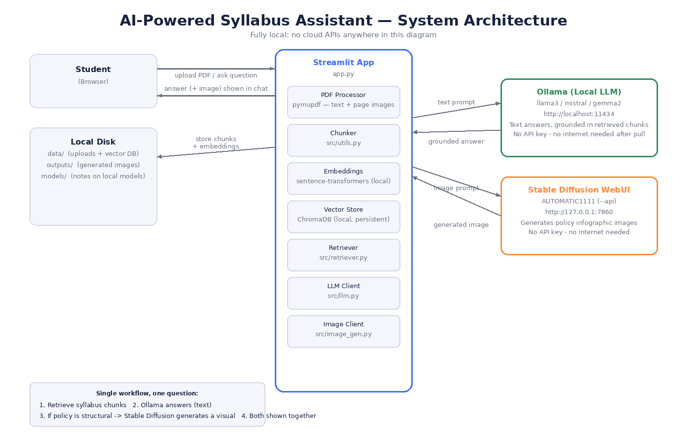
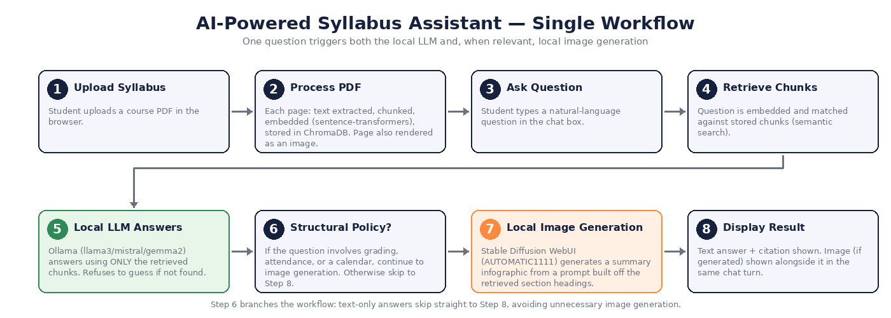
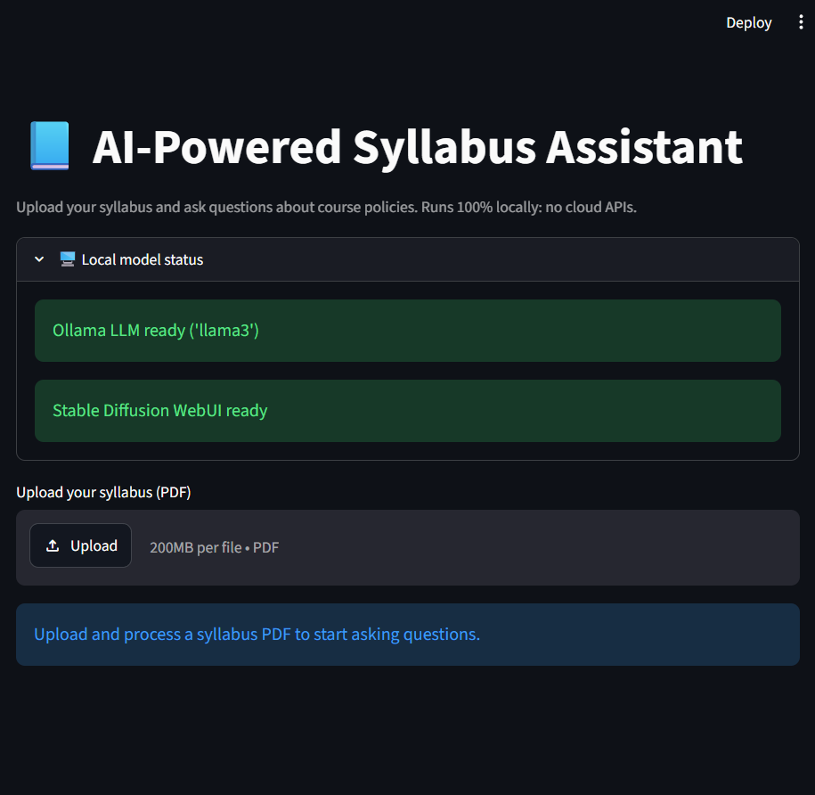
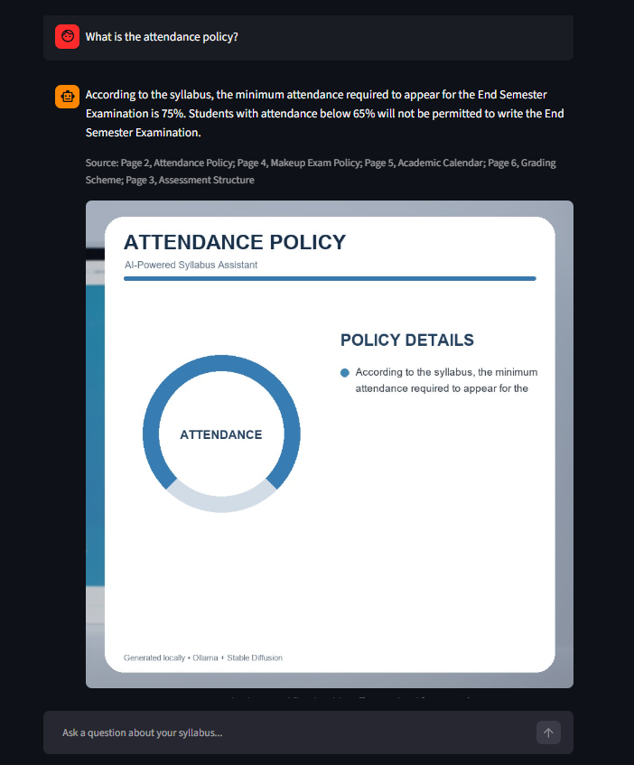
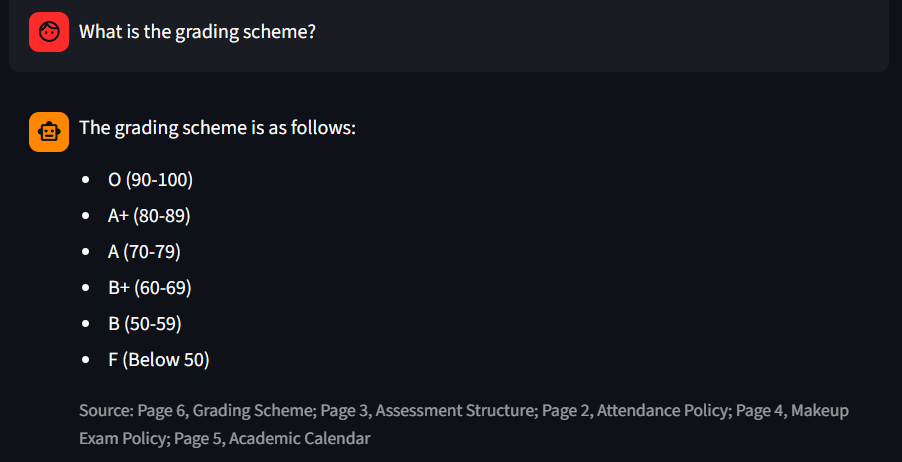
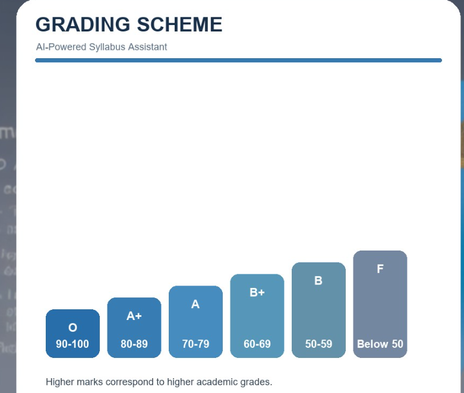

# AI-Powered Syllabus Assistant

A fully local AI application designed to help university students quickly find and understand information from syllabus documents.

The application combines Retrieval-Augmented Generation (RAG), Llama 3 through Ollama, and Stable Diffusion through AUTOMATIC1111. No cloud AI APIs are used.

---

## Problem Statement

University syllabi contain important information about grading schemes, attendance requirements, assessment structures, examination policies, and academic calendars. Finding specific information manually in lengthy PDF documents can be time-consuming.

The AI-Powered Syllabus Assistant allows students to upload a syllabus PDF and ask questions in natural language. Relevant syllabus sections are retrieved and provided to a locally hosted Llama 3 model for answer generation.

For structured academic policy questions, the system also generates a visual summary using a locally hosted Stable Diffusion model.

---

## Features
- Upload and process university syllabus PDFs
- Semantic search using embeddings and ChromaDB
- Local Llama 3 text generation through Ollama
- Source-aware answers based on syllabus content
- Local Stable Diffusion image generation
- Topic-specific visuals for:
  - Grading schemes
  - Attendance policies
  - Assessment structures
  - Academic calendars
  - Makeup/retest policies
- Streamlit conversational interface
- Fully local processing with no cloud AI APIs

  ## Architecture

## Workflow


## Technology Stack
| Component | Technology |
|---|---|
| Frontend | Streamlit |
| Programming Language | Python |
| Document Processing | PyMuPDF |
| Embeddings | Sentence Transformers |
| Vector Database | ChromaDB |
| Local LLM | Llama 3 via Ollama |
| Image Generation | Stable Diffusion |
| Image API | AUTOMATIC1111 WebUI API |
| Retrieval | Retrieval-Augmented Generation (RAG) |

## How It Works
1. The student uploads a university syllabus PDF.
2. The PDF is processed and divided into text chunks.
3. Embeddings are generated for the extracted syllabus content.
4. The embeddings are stored in ChromaDB for semantic retrieval.
5. When the student asks a question, the system retrieves the most relevant syllabus chunks.
6. The retrieved context is provided to Llama 3 through Ollama.
7. Llama 3 generates a syllabus-grounded textual answer.
8. For structured academic policy questions, the application also generates a visual using local Stable Diffusion through AUTOMATIC1111.
9. The text answer and generated visual are displayed together in the Streamlit interface.
---
## Screenshots
### Application Interface


### Syllabus Upload


### Text Answer


### Generated Visual


### Additional Application Output


## Evaluation

The project includes an evaluation component for testing syllabus retrieval and answer quality.

```text
evaluation/
├── evaluate.py
└── test_questions.json

## Limitations

- Stable Diffusion generation can be slow on CPU-only systems.
- Image-generation models may not reliably render exact textual information or numerical values.
- Answer quality depends on the quality and structure of the uploaded syllabus.
- Local AI models require sufficient system resources.
- Generated visuals are supplementary summaries; the syllabus-grounded textual answer remains the primary source of factual information.

## Future Improvements

- Support multiple syllabus documents simultaneously.
- Add richer page-level source highlighting.
- Improve visual generation using structured templates for exact academic data.
- Add multilingual syllabus support.
- Add GPU acceleration options for faster local image generation.
- Provide downloadable answers and visual summaries.
